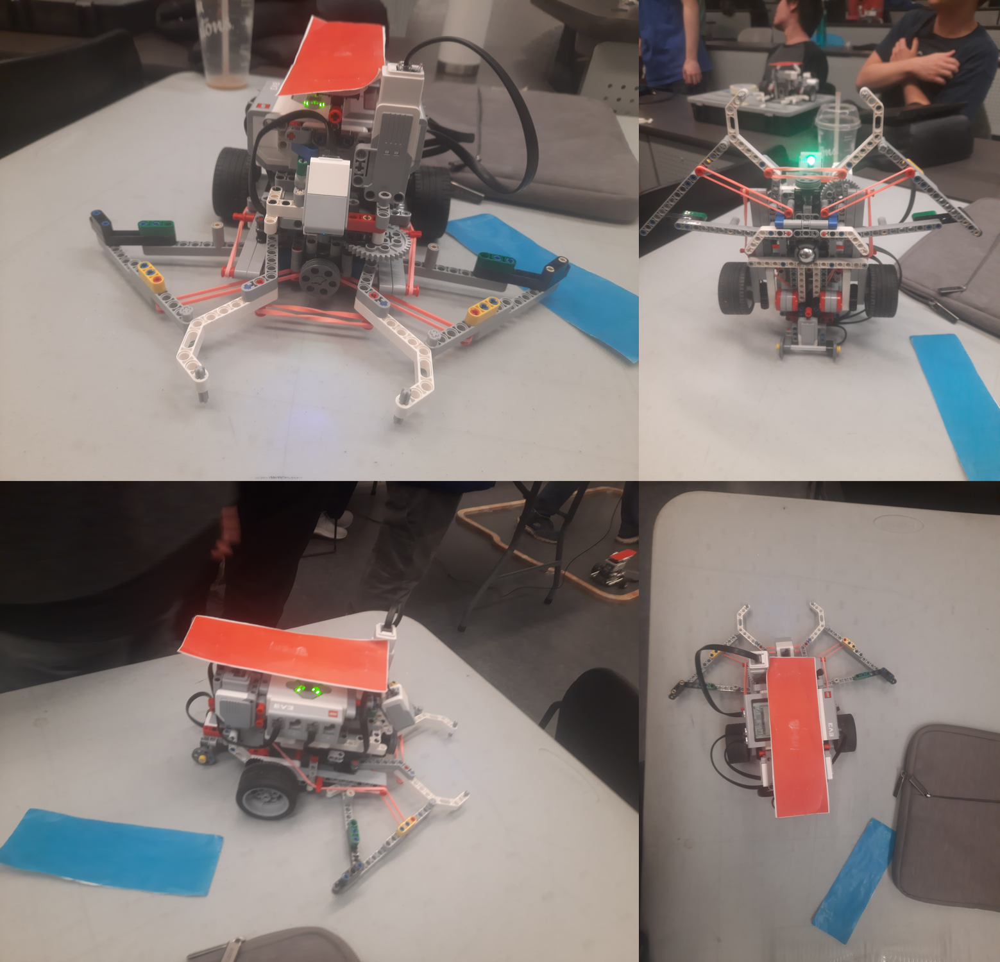

# CSCC85 Project 3 RoboSoccer

Project code for the robosoccer for Choose The Napkin.

## Photos

## Features
- A battering ram like mechanism for shooting the ball
- Suspensions on claws using rubber bands
- Wing-like structures to increase frontal surface area
- Colour sensor to detect exactly when ball is in possession
- Touch sensor for feedback based rewinding of launcher

## Video

https://youtu.be/3U22YUuJi5U

## Installation and Running

Will compile and run on Linux provided the OpenGL and Bluetooth libraries are
installed.

From the project's folder type:

>./configure

If any dependencies are missing, install them and re-run configure.

Once the configuration ends successfully, type

>make

The executable file will be in ./src so you can run it with

./src/roboSoccer /dev/video1 0 0

See the executable's usage doc. for the meaning of each
command line parmeter.

